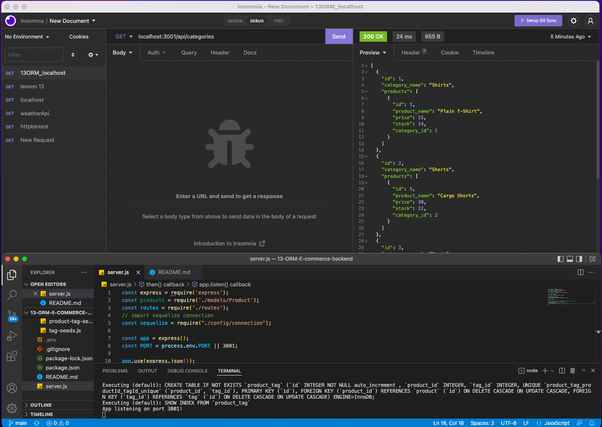

# 13-ORM-E-commerce-backend
This Challenge is for Unit 13 ORM E-commerce backend applications.

## Product Description
The E-commerce Object-Relational Mapping challenge used back end applications like node.js, Express, Sequelize and MySQL.  The purpose of this project is to show the various tags and categories of various products.  We can change the tags and product categories using the different routes for each model.  

## Table of Contents
- [Utilize the Challenge](#utilize-the-challenge)
- [Screenshot](#screenshot)
- [Run the Program](#run-the-program)
- [Video Walkthrough](#video-walkthrough)
- [Acknowledgements](#acknowledgements)
- [Contact Me](#contact-me)

## Utilize the Challenge
I used several node modules to start this challenge.  We installed Express, Sequelize and MySQL.  We modularized the challenge by using specific folders and files for Models, API Routes and database seeds.  This helped to compartmentalize and give the overall challenge structure and usability.  After we laid down the ground work in code, we can then run the seeds to show in dBeaver, as well as Insomnia.  In Insomnia we can GET all categories or a specific category.  We can POST, to create and update, tags or products.  You can even utilize the Destroy to delete products, categories or tags as well.  

## Screenshot

## Run the Program
This one is simple, open the file.  Open integrated terminal.  Please make sure the important node_modules in the package.json is downloaded.  Next, in the terminal, type npm run seed.  This will utilize the connection to dBeaver and Insomnia.  In the terminal either enter npm start or node server.js, this will open the port to the local host.  Go to your opened Insomnia and feel free to GET, POST and DEL.  

## Video Walkthrough
[Video Link]()

## Acknowledgements
A huge thank you to the Veronica the Amazing TA and the other instructional staff, John and Andy, in our UCF Bootcamp class.
I relied heavily on the README and the module lessons throughout the week, specifically, 22-25 and the mini-project module 28.  

## Contact Me
- [Github Link](https://github.com/CanRo2B)
- [Email](mailto:hofe36@hotmail.com)